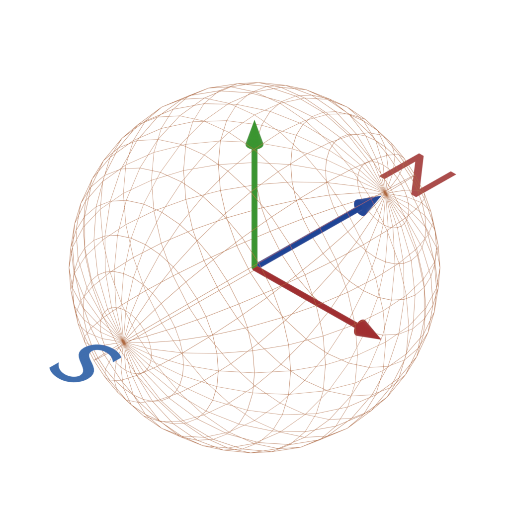

# Sensor pub-sub

## Description

The system consists of a consumer an N-publishers identified by an 8 bit id.

A publisher simulates "random" motion of a device and outputs the resultant sensor readings with artificial measurement noise superimposed on top.
It sends the packet containing the IMU payload as a datagram with a sequence number for ordering.

The consumer collects messages and puts them in a queue corresponding to the sender for ordering.
After each packet it attempts to update the estimated orientation of remote sensors.
It uses a simple complementary filter which combines integrated gyroscope rates for fine movement accuracy and tilt-compensated magnetometer readings for long term stability and recovery of orientation.

The coordinate system assumed is as per the below image


 
## Installation

Recommended python3.12+

1. Clone this repository
2. Run `pip install -r requirements.txt`
3. Optionally run `pip install -r requirements-vis.txt`
4. Using visualization on linux might require the `libxcb-cursor0` package

## Running the Application

To start the consumer:
```
python3 -m src.consumer --socket-path ./tmp.sock
```

To start the publisher:
```
python3 -m src.publisher --socket-path ./tmp.sock --frequency-hz 500
```

Both accept a `--visualize` flag which will display the internal orientation of the publisher or the orientation estimated by the consumer

## Examples

- Video showing 2 publishers pushing updates to the consumer, with visualization enabled

[demo_A.webm](https://github.com/user-attachments/assets/c39a6f15-567b-475d-885e-4e805e6e3222)

- Video showing recovery capability of both processes.

[demo_recovery.webm](https://github.com/user-attachments/assets/3cf20b7a-8b47-4861-aadd-b9754473fe06)
